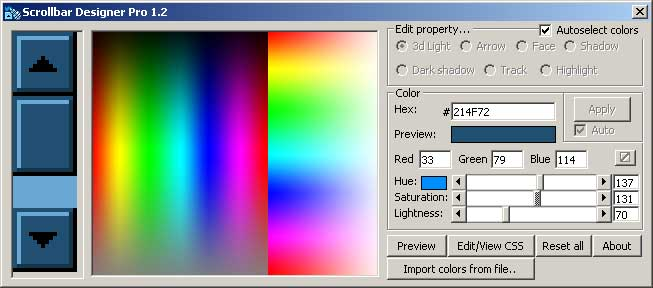



## Scrollbar Designer Pro 1\.2

### Description

Sets scrollbar colors for HTML pages. Includes a color picker with RGB or hue/saturation/lightness support. Easy click and select interface. Generates complete CSS code. Also shows correct color on the track when no track color is selected. Includes a preview with a real internet explorer control.   Changes in version 1.2:

* no longer save to c:\ (uses app.path..)

* tooltips for easier understanding

* autogenerate colors from one color

* bigger colormap, 65773 colors rather than 5989

* import colors from html/css file

* edit css code (useful if you have css in the clipboard..)
 
### More Info
 
RGB/HSL

CSS Code

             |
---                |---
**Submitted On**   |2003-10-03 18:15:02
**By**             |[aDe\_n](https://github.com/Planet-Source-Code/PSCIndex/blob/master/ByAuthor/ade-n.md)
**Level**          |Intermediate
**User Rating**    |5.0 (25 globes from 5 users)
**Compatibility**  |VB 6\.0
**Category**       |[Graphics](https://github.com/Planet-Source-Code/PSCIndex/blob/master/ByCategory/graphics__1-46.md)
**World**          |[Visual Basic](https://github.com/Planet-Source-Code/PSCIndex/blob/master/ByWorld/visual-basic.md)
**Archive File**   |[Scrollbar\_1653501032003\.zip](https://github.com/Planet-Source-Code/ade-n-scrollbar-designer-pro-1-2__1-48809/archive/master.zip)

